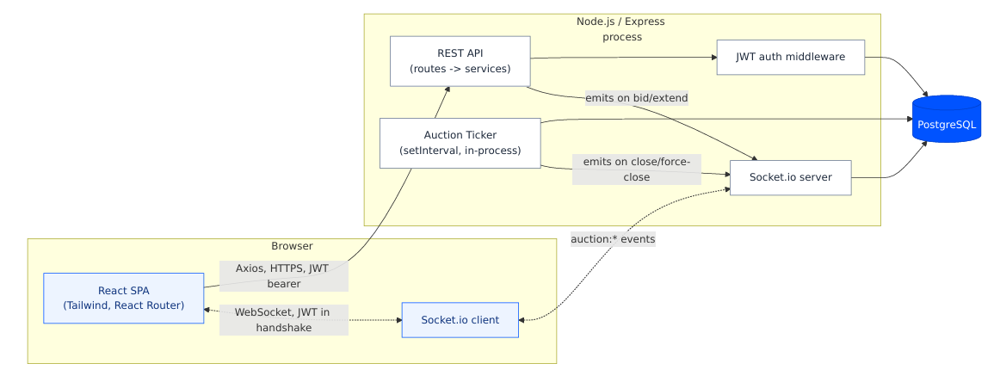

# BidFlow

**A real-time British Auction platform for freight RFQs — open bidding, live rankings, and automatic anti-sniping extensions.**


---

## What it is

A British Auction is not a sealed-bid RFQ. Every supplier sees every other supplier's current price and races to undercut it — openly, in real time. BidFlow builds that mechanic end to end: a buyer posts a shipment RFQ with a bidding window, suppliers submit competing bids that rank live (L1, L2, L3...), and the platform automatically extends the closing time whenever a bid lands too close to the deadline — right up to a hard, immutable ceiling — so nobody wins by sniping in the final second.

Everything updates for every connected client the instant it happens. No polling, no manual refresh.

**[Live demo →](https://bid-flow-beta.vercel.app/dashboard)** · seeded demo accounts and passwords in [`docs/SEED_DATA.md`](docs/SEED_DATA.md)

## Engineering highlights

- **Concurrency-safe bidding.** Every bid submission takes a `SELECT ... FOR UPDATE` row lock inside a single Prisma transaction — the one deliberate raw-SQL exception in an otherwise fully-typed data layer. Two suppliers bidding on the same RFQ at the same instant are serialized, never racing.
- **Nothing that can go stale, because nothing is cached.** Auction status and supplier ranking are never stored — they're pure functions of timestamps and bid history, recomputed on every read. A displayed status can't disagree with the data it came from; there's no cache to invalidate.
- **A real anti-sniping algorithm, not a fixed timer.** Each auction configures its own trigger window, extension length, and one of three trigger policies (any bid, any rank change, or only a change at the top) — evaluated fresh against the ranking before and after every bid.
- **Live sync across every open tab.** Socket.io rooms scope broadcasts to exactly who's watching a given auction or the dashboard — authenticated once at handshake with the same JWT as the REST API.
- **A resilient background worker.** The ticker that closes overdue auctions survives a transient database outage without taking the whole process down — logged and retried on the next tick, not a crash.
- **Idempotent by construction.** The ticker and a live bid can both try to close the same auction; whichever gets there first wins, guarded by "does a terminal event already exist" rather than a status flag.

Full reasoning for every decision above — alternatives considered, tradeoffs made — is in [`README.md#architecture-decisions`](#architecture-decisions) below and [`docs/HLD.md`](docs/HLD.md).

## Architecture



One Express process serves both the REST API and a Socket.io connection over the same HTTP server. A single PostgreSQL database is the only datastore. A lightweight in-process ticker closes auctions on schedule even with nobody watching.

## Tech stack

| Layer | Choice |
|---|---|
| Frontend | React 19, TypeScript, Tailwind CSS v4, React Router 7, Axios |
| Realtime | Socket.io (client + server) |
| Backend | Node.js, Express 5, Socket.io |
| Database | PostgreSQL via Prisma 6 |
| Auth | JWT (login-only), bcrypt |
| Validation | zod |
| Testing | Vitest |

## Getting started

Requires Node 20+ and a PostgreSQL database (local or hosted — a hosted instance like Neon, Supabase, or Prisma Postgres needs no local Postgres install at all).

**Backend**

```bash
cd backend
npm install
cp .env.example .env   # fill in DATABASE_URL and JWT_SECRET
npm run prisma:migrate
npm run seed
npm run dev             # http://localhost:4000
```

**Frontend** (in a separate terminal)

```bash
cd frontend
npm install
cp .env.example .env   # defaults to http://localhost:4000, adjust if needed
npm run dev             # http://localhost:5173
```

Log in with any seeded account from [`docs/SEED_DATA.md`](docs/SEED_DATA.md) — e.g. `buyer1@rfq-demo.com` / `Password123!`.

**Running tests**

```bash
cd backend
npm test                # unit tests for the pure auction-rule functions
```

## Documentation

- [`docs/HLD.md`](docs/HLD.md) — architecture, core auction logic, sequence diagrams, API design
- [`docs/DATABASE_SCHEMA.md`](docs/DATABASE_SCHEMA.md) — table definitions, ER diagram, validation rules
- [`docs/SEED_DATA.md`](docs/SEED_DATA.md) — seeded users, passwords, and which RFQ demonstrates which auction state

## Architecture Decisions

**PostgreSQL.** The domain is inherently relational — RFQs, bids, and suppliers connected by foreign keys — and the hardest problem in this system (safely ranking bids and extending auctions under concurrent writes) needs transactional row-level locking (`SELECT ... FOR UPDATE`), which Postgres provides natively.

**Prisma.** Type-safe queries and migrations for the majority of the app — user/RFQ CRUD, read queries. One deliberate exception: the bid-placement transaction drops to a raw `SELECT ... FOR UPDATE` inside a Prisma interactive transaction, since Prisma's query builder has no first-class row-locking syntax.

**Socket.io.** Live countdowns, bid updates, ranking changes, and auction extensions all need to reach connected clients without polling. Room support (`rfq:{id}` per auction) keeps broadcasts scoped to clients actually viewing that auction instead of pushing every event to everyone.

**JWT, access token only, no refresh.** Chosen over server-side sessions specifically because Socket.io needs a portable credential at handshake time — a JWT drops into `socket.handshake.auth.token` directly, while sharing an Express session store with a separate socket server is more moving parts for no real benefit at this scope.

**Computed status, not a stored column.** Whether an auction is Active, Closed, or Force Closed is a pure function of its timestamps (`computeStatus`), evaluated fresh on every read and inside every bid transaction — never cached in the database. This makes it structurally impossible for a displayed status to disagree with the timestamps that define it.

**Computed rankings, not stored.** L1/L2/L3 ranking is derived at query time from each supplier's *active bid* — their single most recent submission on an RFQ. Every earlier bid from the same supplier remains in the table as immutable history (never updated or deleted), which doubles as the auction's activity log. Full schema in [`docs/DATABASE_SCHEMA.md`](docs/DATABASE_SCHEMA.md).

**A monolith, not microservices.** One Express process, one Postgres database, one React app. At this scale — a handful of RFQs, a handful of suppliers each — splitting this into separate services would add deployment and coordination overhead with no corresponding benefit.

## Project structure

```
BidFlow/
  README.md
  docs/                  HLD, schema, seed data
  backend/
    prisma/              schema, migrations, seed script
    src/
      routes/            HTTP boundary — validate, call a service, map errors
      services/          business logic — RFQ, bid, dashboard, auth
      lib/               pure auction-rule functions (the tested core)
      sockets/           handshake auth, room join/leave, all outbound events
      ticker/            background auction-closer
    tests/               unit tests for lib/auction-rules.ts
  frontend/
    src/
      pages/             one component per route
      components/        feature components (bid form, rank table, activity log...)
      components/ui/     hand-rolled design system primitives
      hooks/              useSocketRoom, useSocketEvent, useCountdown
      context/           auth state
```
