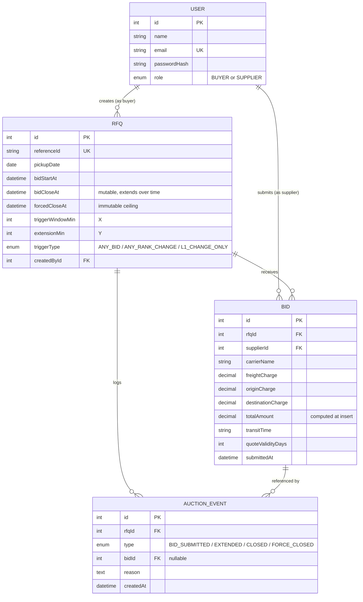

# Database Schema — British Auction RFQ System

## Design principles

- **Two things are deliberately never stored, only computed at read time:
  auction `status` and supplier `rank`.** Both are pure functions of data
  that's already in the tables (timestamps; the set of latest bids per
  supplier). Storing either as a column would create a second source of
  truth that can drift from the timestamps/bids it's derived from — see
  `HLD.md` §3 for the functions themselves.
- **Bids are append-only, and only one bid per supplier is ever "active."**
  Every submission inserts a new row; nothing is ever updated in place. For
  a given RFQ, a supplier's **active bid** is their single most recent row
  (by `submittedAt`) — the moment a newer one is inserted, the previous row
  becomes **historical**: kept in the table permanently, immutable, never
  deleted or hidden. Ranking (`computeRanking`, `HLD.md` §3.2) only ever
  operates on the set of active bids, one per supplier — it never sees
  historical rows. Historical bids aren't dead weight, though: they *are*
  the audit trail §8 asks for ("activity log showing bid submissions"),
  surfaced via `AuctionEvent` rows that reference the specific `Bid` that
  caused each event — active or historical at the time it was recorded. No
  separate bid-history table needed.
- **Money fields are `DECIMAL`, never `FLOAT`/`DOUBLE`.** Floating-point
  rounding is unacceptable for anything that resembles currency, even in a
  demo seeded with fake data.

## Tables (Prisma schema sketch)

```prisma
enum Role {
  BUYER
  SUPPLIER
}

enum TriggerType {
  ANY_BID
  ANY_RANK_CHANGE
  L1_CHANGE_ONLY
}

enum EventType {
  BID_SUBMITTED
  EXTENDED
  CLOSED
  FORCE_CLOSED
}

model User {
  id           Int      @id @default(autoincrement())
  name         String
  email        String   @unique
  passwordHash String
  role         Role
  createdAt    DateTime @default(now())

  rfqsCreated  Rfq[]    @relation("RfqCreator")
  bids         Bid[]
}

model Rfq {
  id               Int         @id @default(autoincrement())
  referenceId      String      @unique
  pickupDate       DateTime
  bidStartAt       DateTime
  bidCloseAt       DateTime                 // mutable — extended over time
  forcedCloseAt    DateTime                 // immutable after creation
  triggerWindowMin Int                      // X
  extensionMin     Int                      // Y
  triggerType      TriggerType
  createdById      Int
  createdBy        User        @relation("RfqCreator", fields: [createdById], references: [id])
  createdAt        DateTime    @default(now())

  bids             Bid[]
  events           AuctionEvent[]

  @@check(bidCloseAt <= forcedCloseAt)      // lifetime invariant — see Validation Rules
  @@index([bidCloseAt])                     // ticker scan for due closures
}

model Bid {
  id                Int      @id @default(autoincrement())
  rfqId             Int
  rfq               Rfq      @relation(fields: [rfqId], references: [id])
  supplierId        Int
  supplier          User     @relation(fields: [supplierId], references: [id])
  carrierName       String
  freightCharge     Decimal  @db.Decimal(12, 2)
  originCharge      Decimal  @db.Decimal(12, 2)
  destinationCharge Decimal  @db.Decimal(12, 2)
  totalAmount       Decimal  @db.Decimal(12, 2)   // computed in the service layer at insert — see note below
  transitTime       String
  quoteValidityDays Int
  submittedAt       DateTime @default(now())

  events            AuctionEvent[]

  @@index([rfqId, supplierId, submittedAt])  // "latest bid per supplier"
  @@index([rfqId, totalAmount])              // ranking query
}

model AuctionEvent {
  id        Int       @id @default(autoincrement())
  rfqId     Int
  rfq       Rfq       @relation(fields: [rfqId], references: [id])
  type      EventType
  bidId     Int?
  bid       Bid?      @relation(fields: [bidId], references: [id])
  reason    String
  createdAt DateTime  @default(now())

  @@index([rfqId, createdAt])
}
```

This is a design sketch, not a final migration — field names/types are
locked in intent, exact Prisma syntax gets verified once we scaffold the
project. Two implementation notes worth flagging now rather than
discovering mid-build:

- **`@@check` support depends on the Prisma version in use.** If it isn't
  available as a schema-level attribute, the same constraint gets added via
  a hand-edited SQL migration (`ALTER TABLE "Rfq" ADD CONSTRAINT ...`) —
  Prisma migrations are plain SQL files, so this is a non-issue either way.
- **`totalAmount` is computed in application code, not a Postgres generated
  column.** A `GENERATED ALWAYS AS (...) STORED` column would be the
  "purist" version of single-source-of-truth, but Prisma's schema language
  doesn't model generated columns natively (they'd need to be declared
  `Unsupported(...)` and managed outside the normal client). Given we've
  already committed to Prisma as the default client, computing the total in
  one shared helper function at bid-insert time gets the same
  can't-drift guarantee without fighting the ORM for a marginal benefit.

## Entity Relationship Diagram



## Validation Rules — what's enforced where, and why

The single trickiest resolution in this whole schema is that §7 states two
rules about `bidCloseAt` vs `forcedCloseAt` that sound like one rule but
aren't, because one is about the *initial* configuration and the other has
to hold for the *entire lifetime* of the row (including after extensions
have legitimately pushed `bidCloseAt` all the way up to the ceiling):

| Rule | Enforced where | Why there, not elsewhere |
|---|---|---|
| `bidStartAt < bidCloseAt` (initial) | App, at RFQ creation | Not a meaningful lifetime DB constraint — `bidCloseAt` legitimately moves after creation; only the initial ordering needs checking. |
| `bidCloseAt < forcedCloseAt` (initial, **strict**) | App, at RFQ creation | §7's literal rule — read as a *creation-time* sanity check that there's a real initial window before the ceiling. |
| `bidCloseAt <= forcedCloseAt` (**always**, non-strict) | **DB CHECK constraint** | This is the actual "extensions must never exceed forced close" rule (§7) — it must hold at every point in the row's life, including the valid terminal state where an extension clamped `bidCloseAt` to exactly equal `forcedCloseAt`. A strict `<` here would make Force-Closed auctions impossible to represent. |
| `triggerWindowMin <= (bidCloseAt − bidStartAt)` | App, at RFQ creation | A trigger window longer than the auction itself is meaningless. Rejected outright rather than allowed-with-a-warning, since a "warn but allow" path adds UX complexity for a case with no legitimate use. |
| `triggerWindowMin > 0`, `extensionMin > 0` | App, at RFQ creation | Not stated explicitly, but required for the config to mean anything. |
| New bid's total < that supplier's own previous total on this RFQ | App, inside the bid transaction | §1's "suppliers can continuously lower their prices" is a ratchet against the bidder's *own* history, not a requirement to beat the current leader. |
| `now() < bidCloseAt` at the moment of write | App, inside the locked transaction | The actual bidding-window check. Computed fresh on every write from `computeStatus()` — never trusts a cached status. |
| `freightCharge, originCharge, destinationCharge >= 0` | App, zod schema on the bid-submission route | Ordinary input sanitization, not a cross-field invariant — unlike the `bidCloseAt`/`forcedCloseAt` rule above, there's no internal code path that could ever push a charge negative, so there's nothing for a DB-level constraint to defend against that the request schema doesn't already catch. |

Two smaller field-modeling calls, made explicit so they don't look like
oversights:

- **`quoteValidityDays` (int), not a date.** "Validity of Quote" in freight
  RFQs conventionally means "valid for N days from submission," which is
  also the more common real-world convention — modeled as a duration, not
  an absolute date, since the source doc doesn't specify units.
- **Integer, not UUID, primary keys.** IDs appear in URLs (`/rfqs/1`), but
  there's no enumeration risk worth guarding against here — every RFQ and
  bid is already visible to every authenticated user by design (open
  bidding, see Interview Notes #9), so hiding sequential IDs would add
  friction without protecting anything.
