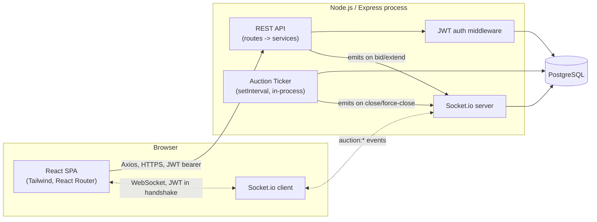

# High-Level Design — British Auction RFQ System

## 1. Overview

A single Node/Express backend, a single PostgreSQL database, and a single
React SPA, connected by REST (for all mutations) and Socket.io (for
server-initiated push). No message broker, no cache layer, no
microservices — a single-instance monolith is the correct scale for this
system's actual load (a handful of RFQs, a handful of suppliers each), and
matches what GoComet's own brief explicitly asks candidates to avoid
over-reaching for.

Everything in this system is either standard CRUD-with-forms (RFQ creation,
login, listing pages) or the one genuinely hard problem: safely deciding,
under concurrent writes, whether a bid changes the ranking and whether the
auction should extend. Section 3 below is the part of this document that
actually matters; the rest is scaffolding around it.

## 2. Component Diagram



All application state lives in Postgres. The server process holds nothing
in memory that matters across a restart — including the ticker, which just
resumes scanning from current DB state on boot. That statelessness is a
deliberate property, not an accident: it means a crash or redeploy mid-auction
loses nothing.

## 3. Core Auction Logic

Three pure functions drive all auction behavior. "Pure" here is load-bearing,
not a buzzword: none of them touch the DB, the clock (except by taking `now`
as an argument), or Socket.io — which is what makes them unit-testable in
isolation and the single most interview-defensible part of the codebase.

### 3.1 `computeStatus(rfq, now)`

Status is never stored — it's computed fresh on every read *and* inside
every bid-submission transaction, so it can never be stale or out of sync
with the timestamps it's derived from.

```
function computeStatus(rfq, now):
    if now < rfq.bidStartAt:      return SCHEDULED
    if now < rfq.bidCloseAt:      return ACTIVE
    if rfq.bidCloseAt >= rfq.forcedCloseAt:  return FORCE_CLOSED
    else:                          return CLOSED
```

`SCHEDULED` is a fourth status added beyond the three the source doc names
(Active/Closed/Force Closed) — purely as a guard against pre-start bidding,
not a feature in its own right. `FORCE_CLOSED` vs `CLOSED` is decided by
whether the *final* `bidCloseAt` (after every extension has been applied and
clamped) equals the ceiling: if extensions pushed it all the way there, it's
Force Closed; if activity died down before reaching the ceiling, it's
Closed.

The API and data model always expose all four values — nothing is hidden or
collapsed. But the UI only has to reconcile this with the spec's three named
statuses when it's actually relevant: any RFQ that has started renders as
Active, Closed, or Force Closed, matching §8 exactly, with no fourth option
ever competing with those. `Scheduled` only ever appears when an RFQ
genuinely hasn't started yet — it's not a reinterpretation of the spec's
status list, just an honest label for a state the spec didn't need to name
because it assumed auctions are already running when viewed.

### 3.2 `computeRanking(latestBidsPerSupplier)`

```
function computeRanking(bids):
    sorted = bids sorted by (totalAmount ASC, submittedAt ASC)
    return sorted.map((bid, i) => ({ ...bid, label: "L" + (i + 1) }))
```

`latestBidsPerSupplier` is itself a query, not a stored value — it computes
each supplier's **active bid** (their most recent row on that RFQ; see
`DATABASE_SCHEMA.md` for the active-vs-historical distinction) via
`DISTINCT ON (supplierId) ... ORDER BY supplierId, submittedAt DESC`, then
re-sorts the result by price for display. Every earlier bid from the same
supplier stays in the table as immutable history — never updated, never
deleted, just excluded from this query. The tie-break on equal totals —
earliest submission wins the better rank — is what makes this deterministic
across repeated calls.

### 3.3 `evaluateExtension(rfq, rankBefore, rankAfter, bidTimestamp)`

```
function evaluateExtension(rfq, rankBefore, rankAfter, bidTimestamp):
    windowStart = rfq.bidCloseAt - rfq.triggerWindowMin minutes
    if bidTimestamp < windowStart:
        return null   // outside the trigger window, no extension

    triggered = switch rfq.triggerType:
        ANY_BID          -> true   // already inside the window
        ANY_RANK_CHANGE  -> rankChanged(rankBefore, rankAfter)
        L1_CHANGE_ONLY   -> rankBefore[0]?.supplierId != rankAfter[0]?.supplierId

    if not triggered:
        return null

    newCloseTime = min(rfq.bidCloseAt + rfq.extensionMin minutes, rfq.forcedCloseAt)
    if newCloseTime <= rfq.bidCloseAt:
        return null   // already at the ceiling — nothing left to extend

    return { newCloseTime, reason: buildReason(rfq.triggerType, ...) }
```

`windowStart` is always measured against the RFQ's *current* `bidCloseAt`,
not its original one — so the anti-sniping window keeps re-arming itself
after every extension instead of only working once.

**`rankChanged(rankBefore, rankAfter)` — the one definition in this whole
system worth spelling out precisely**, because §6.3(b)/(c) don't define what
"a rank change" means when a brand-new supplier enters mid-auction:

```
function rankChanged(before, after):
    n = min(before.length, after.length)
    for i in 0..n:
        if before[i].supplierId != after[i].supplierId:
            return true
    return false
```

Comparing only the positions that existed in *both* snapshots means: a new
supplier who slots in above existing bidders pushes them down a rank and
correctly counts as a change (their existing position numbers shift); a new
supplier whose first bid lands at the very bottom, below everyone already
there, doesn't disturb any existing supplier's rank number and correctly
does **not** count as a rank change under `ANY_RANK_CHANGE`/`L1_CHANGE_ONLY`
— though it always counts under `ANY_BID`, since a bid was submitted
regardless of its effect on ranking.

A useful side effect of this definition: with only one supplier ever
bidding on an RFQ, `rankChanged` can never return true (there's no one to
overtake), so `ANY_RANK_CHANGE`/`L1_CHANGE_ONLY` can never trigger an
extension — only `ANY_BID` can. Worth knowing so it doesn't look like a bug
during a demo with a single-supplier RFQ.

**Activity log reasons** are concrete, human-readable strings, not enum
codes, per §8's explicit "reason for each extension":

| Event | Reason text |
|---|---|
| Bid submitted | `"{carrierName} submitted a bid of {totalAmount}."` |
| Extended (ANY_BID) | `"New bid received within the trigger window — extended to {newCloseTime}."` |
| Extended (ANY_RANK_CHANGE) | `"Supplier ranking changed within the trigger window — extended to {newCloseTime}."` |
| Extended (L1_CHANGE_ONLY) | `"New lowest bidder (L1) within the trigger window — extended to {newCloseTime}."` |
| Closed | `"Bid close time reached with no further qualifying activity — auction closed."` |
| Force Closed | `"Auction reached its Forced Close Time — bidding closed permanently."` |

## 4. Bid Submission — Sequence Diagram

This is the transaction that has to get concurrency right. Two suppliers
submitting within milliseconds of each other must be serialized, or both
can compute themselves as the new L1 off the same stale read.

```mermaid
sequenceDiagram
    participant C as Supplier (client)
    participant API as Express route
    participant SVC as BidService
    participant DB as PostgreSQL
    participant IO as Socket.io

    C->>API: POST /api/rfqs/:id/bids
    API->>SVC: submitBid(rfqId, supplierId, payload)
    SVC->>DB: BEGIN; SELECT rfq ... FOR UPDATE
    DB-->>SVC: rfq row (locked for this transaction)
    SVC->>SVC: computeStatus(rfq, now)
    alt not ACTIVE
        SVC->>DB: ROLLBACK
        SVC-->>API: 409 Auction is not open for bidding
    else ACTIVE
        SVC->>DB: this supplier's latest previous bid, if any
        SVC->>SVC: validate newTotal < previousTotal
        alt invalid
            SVC->>DB: ROLLBACK
            SVC-->>API: 422 Must be lower than your previous bid
        else valid
            SVC->>DB: rankBefore = latest bid per supplier
            SVC->>DB: INSERT new bid
            SVC->>DB: rankAfter = latest bid per supplier (incl. new bid)
            SVC->>DB: INSERT AuctionEvent(BID_SUBMITTED)
            SVC->>SVC: evaluateExtension(rfq, rankBefore, rankAfter, now)
            opt extension triggered
                SVC->>DB: UPDATE rfq.bidCloseAt = newCloseTime
                SVC->>DB: INSERT AuctionEvent(EXTENDED, reason)
            end
            SVC->>DB: COMMIT
            SVC-->>API: 201 { bid, rank, newCloseTime? }
            API-->>C: 201 response
            SVC->>IO: emit auction:bid_placed (+ auction:extended if applicable)
            IO-->>C: broadcast to rfq:{id} room
        end
    end
```

The `SELECT ... FOR UPDATE` is what makes this safe under concurrency: it's
a Prisma **interactive transaction** (`prisma.$transaction(async (tx) => {
... })`) with one `tx.$queryRaw` call for the row lock, then plain Prisma
calls (`tx.bid.create`, `tx.rfq.update`) for everything else inside that
same transaction. Prisma's query builder has no first-class row-locking
syntax, so this is the one deliberate exception to "Prisma everywhere" —
see Interview Notes #8 for the full reasoning and the atomicity-vs-isolation
distinction it's answering.

## 5. Auction Ticker — closing auctions nobody is actively bidding on

Nothing triggers a check when an auction's close time arrives if no
supplier is mid-bid at that moment — so a lightweight ticker (a single
`setInterval`, e.g. every 5s, in the same Node process — no `node-cron`, no
separate worker, no queue) periodically:

1. Finds RFQs where `bidCloseAt <= now()` and no terminal `AuctionEvent`
   (`CLOSED` or `FORCE_CLOSED`) has been recorded for them yet.
2. For each, computes the final status via the same `computeStatus()`
   function used everywhere else, inserts exactly one terminal event with
   the appropriate reason text, and emits `auction:closed` to that RFQ's
   room and the listing-summary room.

This is idempotent by construction — guarded by "does a terminal event
already exist," not by flipping a status flag — so a missed tick, an
overlapping run, or a server restart mid-scan is all harmless. It also means
the ticker's only job is producing the one-time historical log entry and
the real-time push; it never needs to be consulted to know whether an
auction is currently open (that's always `computeStatus()`, called fresh).

## 6. Realtime Design (Socket.io)

- **Auth at handshake**, not per-event: `io.use((socket, next) => { verify
  JWT from socket.handshake.auth.token; next() })`. Sockets that skip this
  would otherwise bypass every REST-layer auth check entirely.
- **Rooms**: `rfq:{id}` (joined while viewing that auction's details page)
  and a single shared `listing` room (joined while viewing the listing
  page). No global broadcast-to-everyone — clients only receive events for
  auctions they're actually looking at.
- **REST for all mutations, Socket.io only for server-initiated push.** Bid
  submission goes through `POST /api/rfqs/:id/bids`, not a socket emit —
  standard HTTP status codes, reusable Express validation, and ordinary
  integration-test tooling (supertest) all apply cleanly to REST in a way
  that request/response-over-sockets makes needlessly awkward.
- **No server-side per-second countdown tick.** The server only emits when
  something actually changes (a bid landed, an extension fired, the
  auction closed). The client receives authoritative `bidCloseAt` /
  `forcedCloseAt` timestamps and runs its own local countdown between
  events — broadcasting a tick every second to every connected client would
  be pure waste.
- **Clock skew**: on `auction:join`, the server includes its own current
  time alongside the close timestamps, so the client can compute an
  offset and correct for drift between its local clock and the server's,
  rather than trusting `Date.now()` outright.

### Events

| Event | Direction | Payload | Purpose |
|---|---|---|---|
| `auction:join` | client → server | `{ rfqId }` | Join the room for a details page |
| `auction:leave` | client → server | `{ rfqId }` | Leave on unmount/navigation |
| `listing:join` / `listing:leave` | client → server | — | Join/leave the shared listing-summary room |
| `auction:bid_placed` | server → client | `{ rfqId, bid, rank }` | New bid landed; update the ranking table live |
| `auction:extended` | server → client | `{ rfqId, bidCloseAt, reason }` | Close time pushed out; update the countdown target |
| `auction:closed` | server → client | `{ rfqId, status, closedAt }` | Terminal transition (`status` is `CLOSED` or `FORCE_CLOSED`) |
| `listing:updated` | server → client | `{ rfqId, lowestBid, bidCloseAt, status }` | Lightweight patch so listing rows update without a full refetch |

## 7. REST API

| Method | Path | Role | Purpose |
|---|---|---|---|
| POST | `/api/auth/login` | any | Authenticate, issue JWT |
| GET | `/api/rfqs` | buyer, supplier | List all RFQs with computed status + current lowest bid |
| POST | `/api/rfqs` | buyer | Create a new RFQ (validated per Schema doc's rules table) |
| GET | `/api/rfqs/:id` | buyer, supplier | Full detail: bids, ranking, config, activity log |
| POST | `/api/rfqs/:id/bids` | supplier | Submit a bid (Section 4's transaction) |

Deliberately not included: PUT/DELETE on RFQs or bids (never requested, and
an append-only/immutable-once-created model has no use for them), a
per-buyer "my RFQs" filter (every RFQ is visible to every authenticated
user by design — see Interview Notes #9), and a separate API-docs file for
now — this table is complete enough at design time; a dedicated docs page
with real example payloads makes more sense once the routes exist and stop
moving.

Request-body validation (required fields, positive numbers, etc.) uses a
small schema-validation library (e.g. `zod`) on both `POST /rfqs` and `POST
/rfqs/:id/bids` — standard practice, low cost, keeps the business-rule
checks in Section 3/4 separate from basic shape validation.

## 8. Auth Layering

Already decided and logged in `INTERVIEW_NOTES.md` (#3, #4): JWT access
token, no refresh, `localStorage` + `Authorization: Bearer`, passed to
Socket.io via the handshake `auth` payload. Mechanically:

- `authenticate` middleware verifies the JWT and attaches `req.user =
  { id, role }`.
- `authorize(role)` middleware factory rejects if `req.user.role` doesn't
  match.
- Every service (RfqService, BidService) depends only on `req.user.id` /
  `req.user.role` — never on how that got populated. That's the entire
  mechanism for keeping auth "swappable later without touching business
  logic": there's no interface to design for it, just a boundary nothing
  crosses.

## 9. Folder Structure

```
GoComet/
  README.md
  INTERVIEW_NOTES.md
  docs/
    HLD.md
    DATABASE_SCHEMA.md
    SEED_DATA.md
  backend/
    prisma/
      schema.prisma
      seed.ts
      migrations/
    src/
      routes/
        auth.routes.ts
        rfq.routes.ts
        bid.routes.ts
      middleware/
        authenticate.ts
        authorize.ts
        errorHandler.ts
      services/
        auth.service.ts
        rfq.service.ts
        bid.service.ts         <- Section 4's transaction lives here
      lib/
        auction-rules.ts       <- computeStatus, computeRanking, evaluateExtension
        serializers.ts         <- shared Bid -> plain-DTO mapping (REST + socket payloads)
        prisma.ts              <- Prisma client singleton
      sockets/
        index.ts               <- io setup, JWT handshake auth, room join/leave
        io.ts                  <- module-level io singleton (set once at boot)
        emit.ts                <- broadcast helpers called from services
      ticker/
        auctionTicker.ts
      app.ts
      server.ts
    tests/
      auction-rules.test.ts    <- unit tests for the pure functions
    .env.example
    package.json
  frontend/
    src/
      pages/
        LandingPage.tsx        <- public, unauthenticated ("/")
        LoginPage.tsx
        AuctionListingPage.tsx <- the dashboard ("/dashboard")
        AuctionDetailsPage.tsx
        CreateRfqPage.tsx
      components/
        ui/                    <- generic design-system primitives
          Button.tsx, Input.tsx, Select.tsx, FormField.tsx, Card.tsx,
          Badge.tsx, Table.tsx, Dialog.tsx, Toast.tsx, Spinner.tsx,
          EmptyState.tsx, icons.tsx
        Layout.tsx              <- AppShell: sidebar + mobile topbar
        CountdownTimer.tsx
        BidForm.tsx
        RankTable.tsx
        ActivityLog.tsx
        AuctionStatusBadge.tsx  <- domain wrapper around ui/Badge
      context/
        AuthContext.tsx
      hooks/
        useSocket.ts           <- useSocketRoom, useSocketEvent
        useCountdown.ts
      lib/
        api.ts                 <- axios instance + auth interceptor
        socket.ts              <- socket.io-client singleton
        format.ts              <- date/currency formatting helpers
      routes/
        ProtectedRoute.tsx
        AppRouter.tsx
      types.ts                 <- shared DTOs mirroring backend response shapes
      App.tsx
      main.tsx
    .env.example
    package.json
```

One repo, two sibling apps (`backend/`, `frontend/`) plus `docs/` at the
root — a monorepo split into two separate repositories would be process
overhead for two tightly-coupled apps built by one person on one timeline.
This is the structure as actually built; it matches the original plan with
a couple of natural additions (`components/ui/` for the design system,
`lib/serializers.ts` to deduplicate a Prisma-Decimal-to-DTO mapping that
was about to be copy-pasted into two services).

## 10. Timeline

Assuming ~5-6 working days, typical for this kind of intern take-home —
tell me the actual deadline if it's different and this gets rebalanced:

- **Day 1** — Schema, migrations, seed script, auth (login + JWT + middleware).
- **Day 2** — Pure rule functions (Section 3) + unit tests. Built and proven
  first, before anything else depends on them — this is the highest-risk
  logic in the system.
- **Day 3** — REST API wired to the rule functions inside the locked
  transaction; Socket.io server + ticker.
- **Day 4** — Frontend: login, listing page, details page (REST-only first,
  no realtime yet).
- **Day 5** — Frontend realtime wiring (socket hooks, live countdown, live
  rank/bid updates) + create-RFQ form.
- **Day 6** — Docs pass (README, verify these two docs still match what was
  actually built, log any deviations in Interview Notes) + a manual
  end-to-end pass across all four auction states (Scheduled, Active,
  Closed, Force Closed).
